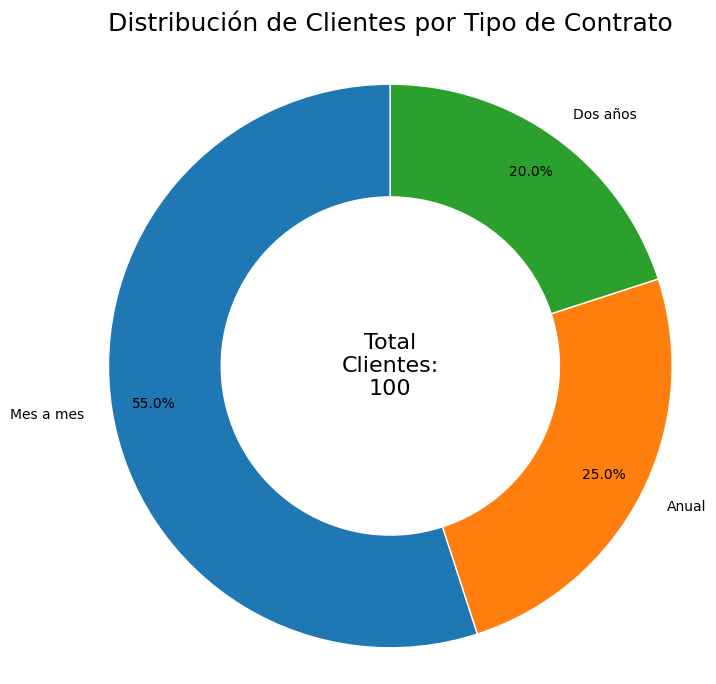

# 📉 Sistema de Alerta Temprana para Fidelización de Clientes (Churn Analysis)

Este proyecto presenta una solución estratégica de **Inteligencia de Negocio** diseñada para reducir la fuga de clientes (Churn) mediante el análisis predictivo del comportamiento del consumidor.

## 🎯 El Problema de Negocio
Identificar que un cliente se ha ido cuando ya canceló su suscripción es demasiado tarde. El costo de adquirir un cliente nuevo es hasta 5 veces más alto que retener a uno actual. Este sistema permite a las empresas actuar **proactivamente**, identificando patrones de insatisfacción antes de que ocurra el abandono.

## 🛠️ Valor Técnico y Estratégico
El núcleo del proyecto es un script de Python (`Customer_Churn_Predictor.ipynb`) que transforma datos históricos en decisiones comerciales:

* **Algoritmo de Scoring de Riesgo:** Creación de un índice personalizado que evalúa la probabilidad de fuga basada en el comportamiento (tickets de soporte, antigüedad y tipo de contrato).
* **Análisis de Correlación:** Identificación de "puntos de dolor", como el alto impacto de los contratos mensuales y la saturación de soporte técnico en la deserción.
* **Entregable de Alto Impacto:** Generación automática de un reporte en Excel (`Accionable_Retencion_Clientes.xlsx`) que el equipo de ventas puede usar como hoja de ruta para campañas de fidelización.

## 📊 Tecnologías Utilizadas
* **Python (Pandas):** Limpieza y estructuración de datos complejos.
* **Seaborn & Matplotlib:** Visualizaciones de patrones de comportamiento.
* **Plotly Express:** Análisis exploratorio de datos para detección de anomalías.
* **Lógica Predictiva:** Implementación de segmentación de clientes por niveles de criticidad.

---
*Solución ideal para modelos de negocio SaaS, e-commerce o suscripciones que busquen proteger su ingreso recurrente (MRR).*
